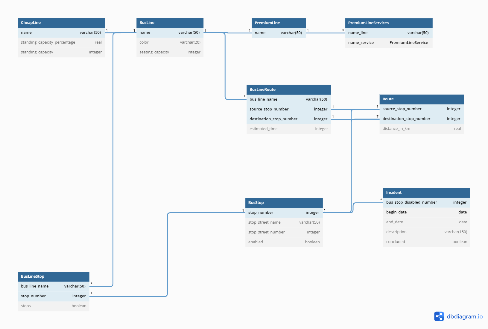

# Gestor de líneas de transporte interurbano

Este proyecto permite la gestión de líneas de transporte a través de:
* CRUD de paradas de transporte en determinadas calles, pudiéndo interconectar las mismas.
* CRUD de líneas de colectivo, teniéndo cada una un trayecto definible con un tiempo estimado en recorrer cada calle.
* CRUD de incidencias en las paradas de transporte, deshabilitando las mismas para su uso.
* Gestión del viaje de un pasajero en el sistema, permitiéndole hallar el camino más rápido, corto o barato para dos paradas concretas.

# Diagrama Entidad-Relación

# Prerrequisitos

* JDK 11
* JavaFX 18.0.1
* PostgreSql 42.4.0
* ControlsFX 11.1.1

# Autores

* **Fernando Sebastián Lomazzi** - [(GitHub page)](https://github.com/Lascot29) 
* **Lucio Rivera** - [(GitHub page)](https://github.com/Afterjack) 

# Licencia
This project is licensed under the MIT License - see the LICENSE file for details. All derivative work should include this license.
